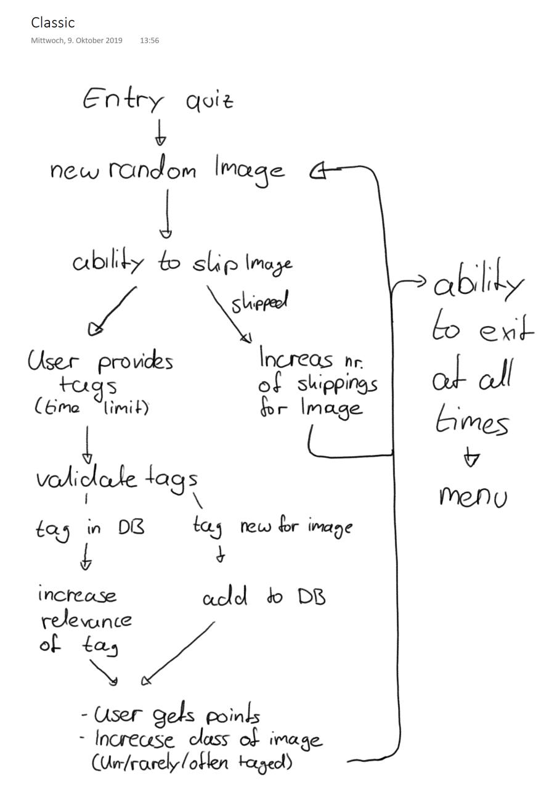
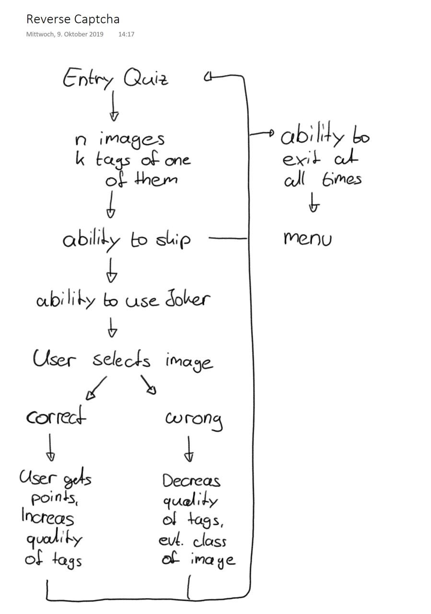

# Entry quiz

We are likely the first players who play this game. Our data is used to bootstrap
the classic game mode. Players are shown an well annotated image to verify themselves as human and as a tutorial for the gameplay.

This first image is not scored.

# User data

The game prototype will be user session based. Users can view a global high score,
select their preferred game mode, read the documentation, access the whole
dataset etc.

We'll consider a signup/signin process in the future.

# Game modes

We propose two game modes, both can be played asynchronously. So the game works
with only one player being online.

## Classic

This game mode has the highest priority.

A player is shown an image for a short duration. During this time they are asked
to provide tags describing the image. The tags are optionally compared to a
dictionary to validate them and then to the dataset.
The player get points for the provided tags based on a schoring scheme and is shown a new image which they
haven't seen before.

Images can be skipped without any penalty.
If an image has been tagged by a specific number of players, we consider the
image well annotated.

### Tags
We evaluated the following constraints:

- in dictionary (optional)
- separated by newline
- character limit (per tag)
- limit number of tags
- limited character set
- no duplicates
- rate limit (interactions per second)

### Scoring system

*Subject of change*

#### Untagged images
- 1 point each tag

#### Rarely tagged image
- 1 point each new tag
- 2 points existing tag

#### Well tagged annotated
- 2 points each tag
- list of illegal (often mentioned) tags

## Reverse Captcha

This game mode requires an existing dataset. This data can be generated by
the classic game mode.

A player is shown a set of images and the most frequent tags for one of them.
They have to choose the corresponding image to get points.
We can optionally implement jokers to eliminate certain wrong options or to
show more tags. This should enhance the gameplay.
We count the recognition rate per image and calculate the quality of the
stored tags. This allows us to consider images with a low quality rate 
untagged.
Images can be skipped without any penalty.

### Scoring system

*Subject of change*

- points for each correct image (depends on time limit of classic mode)
- optionally fewer points if joker was used
